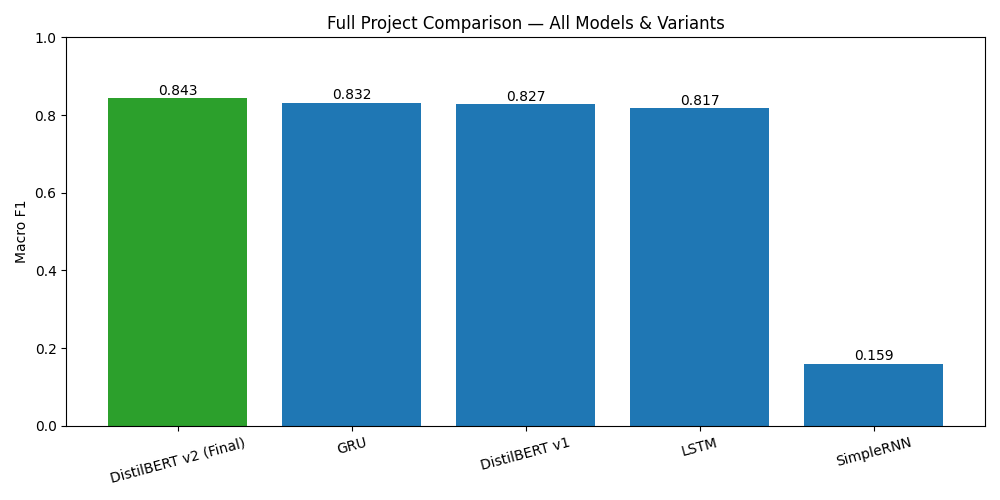
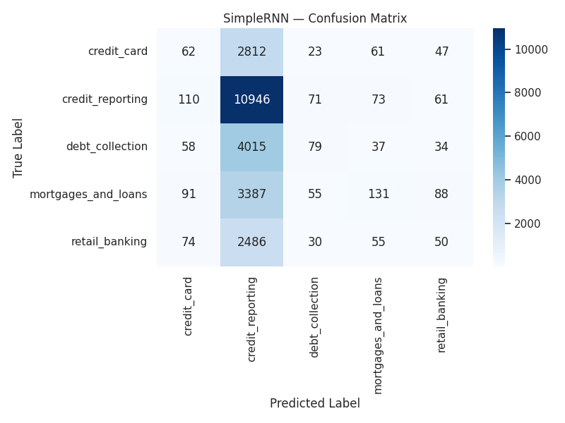
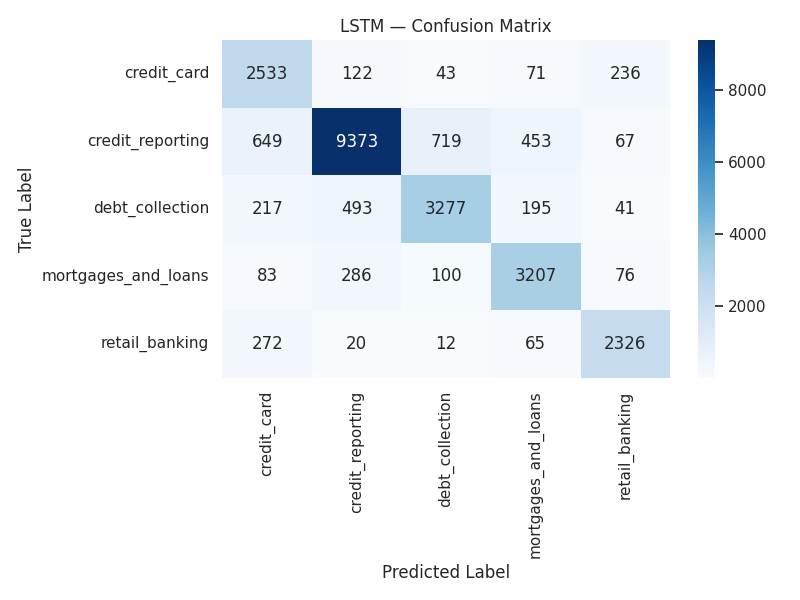
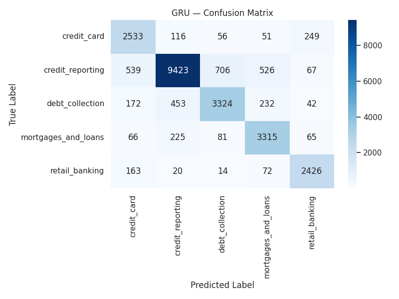
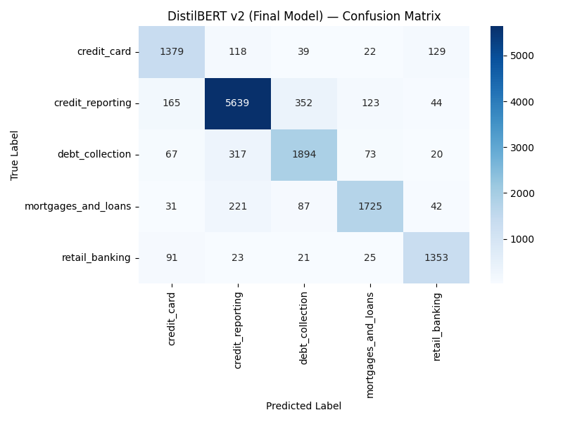
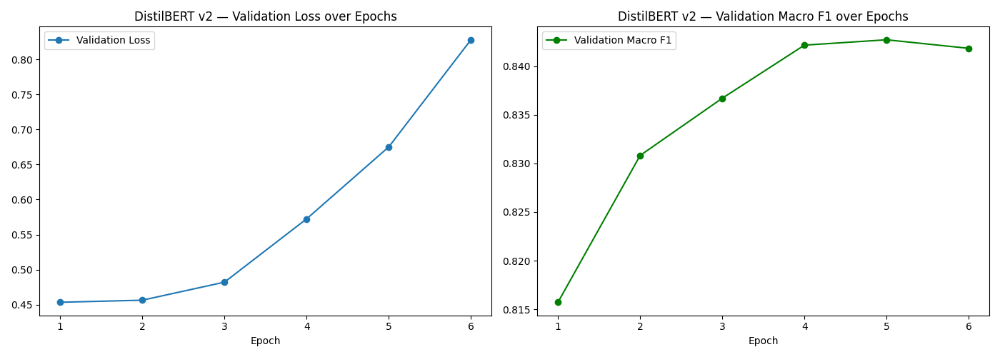

<div align="center">

# 📋 Consumer Complaint Classifier

**An end-to-end NLP pipeline that reads a raw consumer complaint and automatically routes it to the right financial category — comparing four deep learning architectures built from scratch to a fine-tuned transformer.**

[](https://consumer-complaint-app.streamlit.app/)
[](https://huggingface.co/AhmedRdwan/consumer-complaint-classifier)
[](https://www.kaggle.com/code/ahmedrdwan/consumer-complaint-classification)
[](https://www.python.org/)
[](https://pytorch.org/)

**[🚀 Try the Live App](https://consumer-complaint-app.streamlit.app/)** · **[🤗 View the Model](https://huggingface.co/AhmedRdwan/consumer-complaint-classifier)** · **[📓 Full Training Notebook](https://www.kaggle.com/code/ahmedrdwan/consumer-complaint-classification)**

</div>

---

## 📚 Table of Contents

- [🧭 Overview](#-overview)
- [🖥️ App Preview](#️-app-preview)
- [🎯 The Problem & Dataset](#-the-problem--dataset)
- [🛠️ Tech Stack](#️-tech-stack)
- [🔬 Approach & Pipeline](#-approach--pipeline)
- [📊 Model Comparison & Results](#-model-comparison--results)
- [🏆 Final Model: DistilBERT](#-final-model-distilbert)
- [⚠️ Known Limitations](#️-known-limitations)
- [📁 Project Structure](#-project-structure)
- [💻 Running Locally](#-running-locally)
- [👤 Author](#-author)

---

## 🧭 Overview

Financial institutions like the CFPB (Consumer Financial Protection Bureau) receive thousands of consumer complaints that must be manually routed to the correct team before they can be resolved. This project builds an **NLP classification system** that automates that routing decision, and — as a learning exercise — benchmarks **four different deep learning approaches** against each other to understand *why* modern NLP architectures outperform classic ones:

| Step | What happens |
|---|---|
| 1 | A user submits a complaint narrative (free text) |
| 2 | The model reads it and classifies it into 1 of 5 categories |
| 3 | The predicted category + confidence score are returned instantly |

This isn't just a single trained model — it's a **comparative study**: `SimpleRNN` → `LSTM` → `GRU` → fine-tuned `DistilBERT`, each trained on the same data and evaluated with the same metrics, so the performance gap between architectures is visible and measurable rather than assumed.

---

## 🖥️ App Preview

<div align="center">


*The 5 categories the model chooses between, shown as interactive cards*

<br><br>


*A complaint classified in real time, with a full probability breakdown across all categories*

</div>

---

## 🎯 The Problem & Dataset

- **Source:** [CFPB consumer complaint narratives](https://www.consumerfinance.gov/data-research/consumer-complaints/), cleaned and consolidated by [halpert3](https://github.com/halpert3/complaint-content-classification-nlp).
- **Size:** ~124,000 complaint narratives after cleaning and de-duplication.
- **Categories (5, consolidated from the original 9):**

| 📊 Credit Reporting | 📞 Debt Collection | 🏠 Mortgages & Loans | 💳 Credit Card | 🏦 Retail Banking |
|---|---|---|---|---|
| Errors on a credit report, disputed entries, credit bureau issues | Repeated collection calls, disputed debts | Mortgages, car loans, payday loans, student loans | Unauthorized charges, billing disputes | Checking/savings accounts, transfers, Venmo |

- **Key challenge — class imbalance:** `credit_reporting` alone makes up **~56%** of the dataset, with the remaining 4 categories roughly evenly split between 8–14% each. This was handled explicitly with **class-weighted loss** across every model, and models were evaluated on **Macro F1** (which treats all classes equally) rather than raw accuracy, which would be misleadingly inflated by the majority class.

---

## 🛠️ Tech Stack

| Category | Tools |
|---|---|
| **Language & Core** | Python, NumPy, Pandas |
| **Classic Deep Learning** | TensorFlow / Keras — `SimpleRNN`, `LSTM`, `GRU` |
| **Transformer Fine-tuning** | PyTorch, 🤗 Transformers (`DistilBERT`), 🤗 Hub |
| **NLP Preprocessing** | NLTK (stopwords, lemmatization), regex |
| **Evaluation** | scikit-learn (classification report, confusion matrix, class weighting) |
| **Visualization** | Matplotlib, Seaborn |
| **Experimentation Environment** | Kaggle Notebooks (GPU) |
| **Deployment** | Streamlit, Streamlit Community Cloud |
| **Model Hosting** | Hugging Face Hub |

---

## 🔬 Approach & Pipeline

```
Raw complaint text
      │
      ▼
┌─────────────────────┐     ┌──────────────────────────┐
│  RNN-family pipeline │     │   Transformer pipeline    │
│  (SimpleRNN/LSTM/GRU)│     │      (DistilBERT)         │
├─────────────────────┤     ├──────────────────────────┤
│ Lowercase            │     │ Raw/near-original text    │
│ Remove punctuation    │     │ (punctuation & casing     │
│ Remove stopwords      │     │  carry signal for a       │
│ Lemmatization         │     │  pretrained transformer)  │
│ Keras Tokenizer       │     │ HuggingFace WordPiece      │
│ Padding (250 tokens)  │     │ Tokenizer (250 tokens)     │
│ Trainable Embedding   │     │ Pretrained DistilBERT      │
│ layer (from scratch)  │     │ weights, fine-tuned        │
└──────────┬───────────┘     └────────────┬──────────────┘
           │                               │
           ▼                               ▼
   Class-weighted training with Early Stopping
           │                               │
           └───────────────┬───────────────┘
                            ▼
              Evaluate on held-out test set
             (Accuracy, Macro P/R/F1, Confusion Matrix)
                            │
                            ▼
              Best model → Deployed via Streamlit
```

Two deliberately different preprocessing pipelines were used — heavy cleaning for the from-scratch RNNs (which start with zero language knowledge), and near-raw text for DistilBERT (which already understands punctuation and grammar from pretraining).

---

## 📊 Model Comparison & Results

Four models were trained and evaluated on the same held-out test set. **Macro F1** is used as the primary metric due to class imbalance.

| Model | Data Used | Epochs (actual) | Accuracy | Macro F1 |
|---|---|---|---|---|
| SimpleRNN | ~100k rows, 250 tokens | 4 | 45.2% | 0.159 |
| LSTM | ~100k rows, 250 tokens | 10 | 83.1% | 0.817 |
| GRU | ~100k rows, 250 tokens | 5 | 84.3% | 0.832 |
| DistilBERT (v1) | 20k rows, 128 tokens | 5 | 83.9% | 0.827 |
| **DistilBERT (v2, final)** | **56k rows, 250 tokens** | **6** | **85.6%** | **0.843** |

<div align="center">

</div>

### Key findings

- **SimpleRNN dramatically underperforms** the gated architectures — direct, visible evidence of the vanishing-gradient problem on long sequences (up to 250 tokens).
- **LSTM and GRU perform almost identically**, with GRU converging in roughly half the epochs — consistent with its simpler gating mechanism.
- **DistilBERT's first run (20k rows, 128 tokens)** nearly matched GRU despite far less data — a strong signal it had headroom to improve.
- **Retraining DistilBERT with more data and the full sequence length (v2)** confirmed the hypothesis: it surpassed every from-scratch model, validating that pretrained language knowledge transfers meaningfully to this domain-specific task.

<details>
<summary><b>📈 Individual confusion matrices (click to expand)</b></summary>
<br>

| SimpleRNN | LSTM |
|---|---|
|  |  |

| GRU | DistilBERT (final) |
|---|---|
|  |  |

</details>

---

## 🏆 Final Model: DistilBERT

**[`AhmedRdwan/consumer-complaint-classifier`](https://huggingface.co/AhmedRdwan/consumer-complaint-classifier)** — a `distilbert-base-uncased` checkpoint fine-tuned on 56,000 stratified CFPB complaint narratives with class-weighted loss and early stopping.

<div align="center">

</div>

**Why DistilBERT over GRU**, despite GRU's data-parity result being close:
- DistilBERT reached a comparable score with **5x less data** in its first run, indicating more headroom than an already-near-saturated GRU.
- As a pretrained model, it generalizes better to **freeform, real-world phrasing** it never saw during fine-tuning — the property that matters most for a public-facing demo.
- Confirmed empirically: with matched sequence length and more data, DistilBERT v2 outperformed GRU on both Accuracy and Macro F1.

---

## ⚠️ Known Limitations

Being transparent about where the model struggles is part of understanding it — a few things worth noting:

- **Class imbalance residue:** Despite class-weighted loss, `credit_reporting` (56% of the training data) can still pull ambiguous predictions toward itself. For example, a detailed, multi-sentence complaint clearly about an **unauthorized credit card charge** was misclassified as `credit_reporting` with 99.9% confidence during manual testing — a case worth investigating further (e.g., analyzing whether longer, more complex sentences are more prone to this pull).
- **Subsampled transformer training:** The final DistilBERT model was trained on 56k of the ~124k available rows (for practical training time on free-tier GPU). Training on the full dataset would likely improve results further.
- **No explicit handling of multi-topic complaints:** A complaint that genuinely spans two categories (e.g., a student loan reported incorrectly on a credit file) forces the model to pick one label, even when both are partially correct.
- **English-only:** The model was trained exclusively on English-language narratives.

---

## 📁 Project Structure

```
consumer-complaint-app/
├── streamlit_app.py                    # Deployed Streamlit application
├── requirements.txt                    # App dependencies
├── README.md                           # This file
├── testing/                            # App screenshots used for QA & documentation
└── outputs/                            # Charts and confusion matrices from the training notebook
    ├── final_full_comparison_chart.png
    ├── distilbert_v2_confusion_matrix.png
    ├── distilbert_v2_training_curves.png
    ├── gru_confusion_matrix.png
    ├── lstm_confusion_matrix.png
    └── simple_rnn_confusion_matrix.png
```

Full training code (all 4 models, EDA, and evaluation) lives in the [Kaggle notebook](https://www.kaggle.com/code/ahmedrdwan/consumer-complaint-classification).

---

## 💻 Running Locally

```bash
git clone https://github.com/ahmed-rdwan/consumer-complaint-app.git
cd consumer-complaint-app
pip install -r requirements.txt
streamlit run streamlit_app.py
```

The app downloads the fine-tuned model directly from the Hugging Face Hub on first run — no local model files needed.

---

## 👤 Author

**Ahmed Rdwan**
🤗 [Hugging Face](https://huggingface.co/AhmedRdwan) · 💻 [GitHub](https://github.com/ahmed-rdwan) · 📓 [Kaggle](https://www.kaggle.com/ahmedrdwan)

<div align="center">
<sub>Built as a portfolio NLP project. Not affiliated with the CFPB.</sub>
</div>
